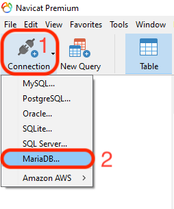
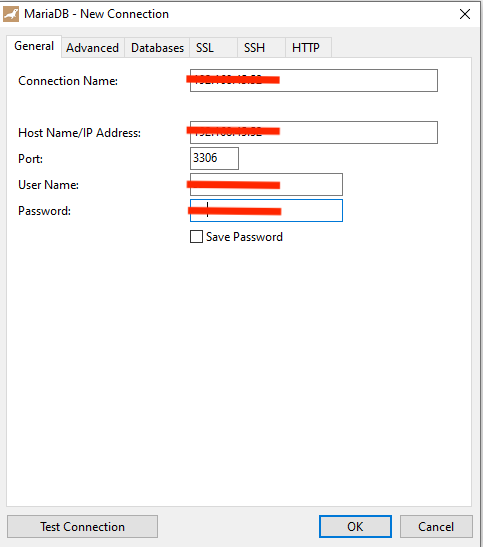
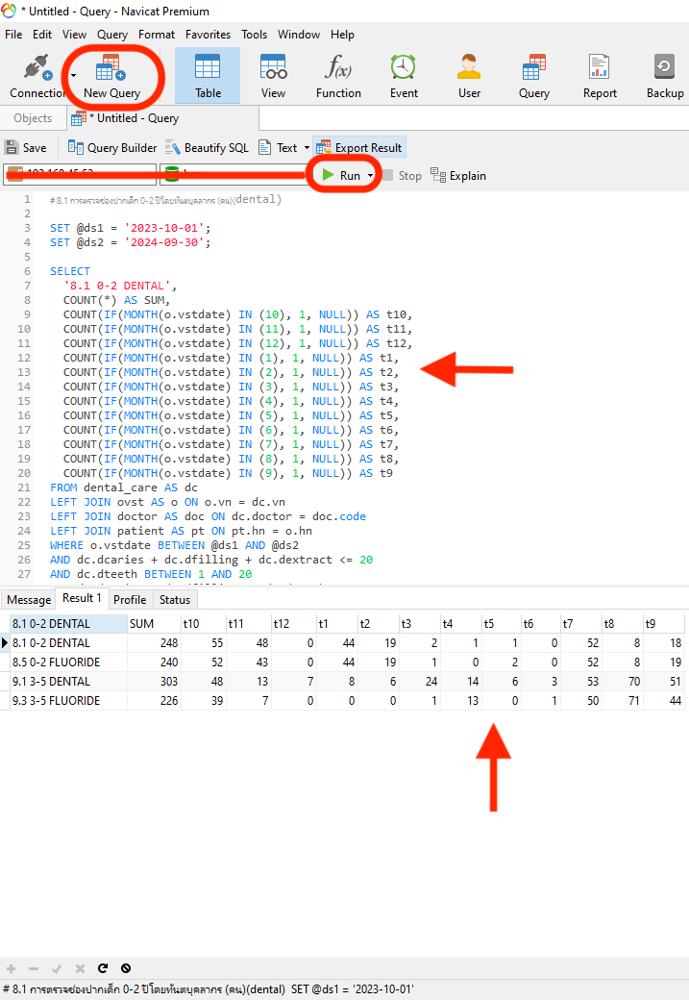
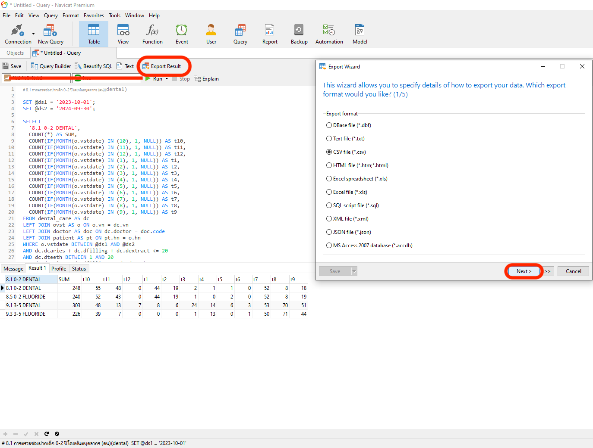

# ตรวจสอบความสมบูรณ์ของแฟ้ม Dental

สมมุติฐาน คือ ข้อมูลการตรวจสุขภาพช่องปากที่บันทึกใน HOSxP จะถูกส่งออกและนำเข้า HDC Pattani ทั้งหมด

> H<subscript>0</subscript>: จำนวนข้อมูลตรวจสุขภาพช่องปากใน HOSxP เท่ากับ จำนวนข้อมูลตรวจสุขภาพช่องปากใน HDC Pattani.
>
> H<subscript>1</subscript>: จำนวนข้อมูลตรวจสุขภาพช่องปากใน HOSxP ไม่เท่ากับจำนวนข้อมูลตรวจสุขภาพช่องปากใน HDC Pattani.

ขั้นตอนการตรวจสอบ

1. [ตรวจสอบข้อมูลใน HDC](#1-ตรวจสอบข้อมูลใน-hdc-pattani)
1. [ตรวจสอบข้อมูลใน HIS (HOSxP)](#2-ตรวจสอบข้อมูลในฐานข้อมูล-his-hosxp)
1. [การเปรียบเทียบข้อมูลในฐานข้อมูล ​HIS (HOSxP) กับข้อมูลใน HDC Pattani](#3-การเปรียบเทียบข้อมูลในฐานข้อมูล-his-hosxp-กับข้อมูลใน-hdc-pattani)

## 1. ตรวจสอบข้อมูลใน HDC Pattani

ตัวชี้วัดที่ต้องการตรวจสอบต้องเป็นตัวชี้วัดบริการ (_i.e. **ทันตกรรม (บริการ)**_)

### 1.1 เข้า HDC Pattani

คลิกลิงค์ [8.1 การตรวจช่องปากเด็ก 0-2 ปีโดยทันตบุคลากร (คน)(dental)](https://ptn.hdc.moph.go.th/hdc/reports/report.php?cat_id=fc73b811eb6d9206e7e5baf8ad20d7b9&id=08d03b47087f5cfa3d1cfdcdd4d7e4b7)

> เลือกการแสดงข้อมูลตามตารางข้างล่างนี้
> | SELECT | เลือกหัวข้อ |
> | ------------------- | ------------------------- |
> | มุมมองการแสดงข้อมูล | ราย cup (เครือข่ายบริการ) |
> | ปีงบประมาณ | 2567 [^footnote1] |
>
> 

[^footnote1]: ปีงบประมาณ2568ใช้รูปแบบการรายงานของHDCแบบใหม่หากข้อมูลไม่แสดงให้กดดูรายงานแบบเก่า

กด **ดูรายงาน**

### 1.2 เก็บข้อมูลตัวชี้วัด

หลังจากกด **ดูรายงาน** จะได้ข้อมูลออกมาดังรูป

### 1.3 เก็บข้อมูลตัวชี้วัดจาก HDC Pattani

ทำ ขั้นตอนที่ 1.1 และ 1.2 กับตัวชี้วัดที่เหลือ

> - [8.1 การตรวจช่องปากเด็ก 0-2 ปีโดยทันตบุคลากร (คน)(dental)](https://ptn.hdc.moph.go.th/hdc/reports/report.php?cat_id=fc73b811eb6d9206e7e5baf8ad20d7b9&id=08d03b47087f5cfa3d1cfdcdd4d7e4b7)
> - [8.5 เคลือบ/ทา ฟลูออไรด์ในเด็ก 0-2 ปี(ครั้ง)](https://ptn.hdc.moph.go.th/hdc/reports/report.php?cat_id=fc73b811eb6d9206e7e5baf8ad20d7b9&id=b7b888d136a807031d4fd3e8719607f6)
> - [9.1 การตรวจช่องปากเด็ก 3-5 ปีโดยทันตบุคลากร (คน)(dental)](https://ptn.hdc.moph.go.th/hdc/reports/report.php?cat_id=fc73b811eb6d9206e7e5baf8ad20d7b9&id=5e7a19bfa7c910848977f72acf986b4a)
> - [9.3 เคลือบ/ทา ฟลูออไรด์ในเด็ก 3-5 ปี(ครั้ง)](https://ptn.hdc.moph.go.th/hdc/reports/report.php?cat_id=fc73b811eb6d9206e7e5baf8ad20d7b9&id=81a4ac535652165557b5724db2096f8f)

หรือกดดาวน์โหลดไฟล์ข้อมูลตัวชี้วัดข้างล่างได้เลย

| KPI                                                      | File                                                                         |
| -------------------------------------------------------- | ---------------------------------------------------------------------------- |
| 8.1 การตรวจช่องปากเด็ก 0-2 ปีโดยทันตบุคลากร (คน)(dental) | [download](./src/hdc_exports/export_data_20250223_1740274149_U2M7H410YK.csv) |
| 8.5 เคลือบ/ทา ฟลูออไรด์ในเด็ก 0-2 ปี(ครั้ง)              | [download](./src/hdc_exports/export_data_20250223_1740274632_EWL9JSMFKP.csv) |
| 9.1 การตรวจช่องปากเด็ก 3-5 ปีโดยทันตบุคลากร (คน)(dental) | [download](./src/hdc_exports/export_data_20250223_1740274565_Q7WEID09ZX.csv) |
| 9.3 เคลือบ/ทา ฟลูออไรด์ในเด็ก 3-5 ปี(ครั้ง)              | [download](./src/hdc_exports/export_data_20250223_1740274666_TCA1VJZCGT.csv) |

## 2. ตรวจสอบข้อมูลในฐานข้อมูล HIS (HOSxP)

> # !! คำเตือน
>
> # ควรให้ผู้ดูแลระบบฐานข้อมูลโรงพยาบาลเป็นผู้ทำขั้นตอนที่ 2 ทั้งหมด

การตรวจสอบข้อมูลจากฐานข้อมูล HIS (HOSxP) ทำได้หลายวิธี ได้แก่

- การเขียนรายงานผ่านโปรแกรม Report Designer ของ BMS
- การรัน SQL Query ผ่านโปรแกรม HOSxP
- การรัน SQL Query ผ่านโปรแกรมจัดการฐานข้อมูล (DBMS)

ในที่นี้ขอนำเสนอวิธีการตรวจสอบข้อมูลจากฐานข้อมูลด้วยโปรแกรม Navicat

### 2.1 การเชื่อมต่อฐานข้อมูล

1. กดปุ่ม **Connection**
1. เลือก **MariaDB..**

   

1. ใส่ข้อมูลสำหรับติดต่อฐานข้อมูล แนะนำให้ใช้เครื่อง slave

| Parameters           | Value                                                      |
| -------------------- | ---------------------------------------------------------- |
| Connection Name:     | ชื่อติดต่อฐานข้อมูลจะตั้งอะไรก็ได้ เช่น hosxp              |
| Hostname/IP Address: | ใส่ไอพีของ mysql server ของ hosxp แนะนำให้ใช้เครื่อง slave |
| Port:                | 3306                                                       |
| User Name:           | username สำหรับเชื่อมต่อ mysql server                      |
| Password:            | password สำหรับเชื่อมต่อ mysql server                      |

4. กด OK

### 2.2 รัน SQL Script

1. กด **New Query**
2. นำ [SQL Script 0-5_dental_fluride_validation.sql](./src/script/0-5_dental_fluride_validation.sql) ใส่
3. กด **RUN** จะได้ผลลัพธ์ข้อมูลออกมาทั้ง 4 ตัวชี้วัด

### 2.3 ส่งออกไฟล์ผลลัพธ์

1. กดปุ่ม **Export result**
1. เลือก Export format เป็น <ins>CSV file (\*.csv)</ins> > กดปุ่ม **Next**
1. เลือก <ins>Include column titles</ins> > กดปุ่ม **Next**
1. เลือกตำแหน่งที่เก็บไฟล์ > กด **Start**
1. นำส่งไฟล์ให้ผู้รับผิดชอบต่อไป
   

## 3. การเปรียบเทียบข้อมูลในฐานข้อมูล HIS (HOSxP) กับข้อมูลใน HDC Pattani

การตรวจสอบข้อมูลใน HDC เพื่อเปรียบเทียบกับข้อมูลใน HIS ต้องใช้ตัวชี้วัด "ทันตกรรม (บริการ)" ซึ่งเป็นข้อมูลที่สะท้อนข้อมูลที่ รพ.เป็นผู้ทำ (ทำที่ไหนข้อมูลขึ้นที่นั่น) หากใช้ตัวชี้วัด "ข้อมูลเพื่อตอบสนอง Service plan สาขาสุขภาพช่องปาก" จะไม่สะท้อนกับข้อมูลที่ รพ.เป็นผู้ (ใช้แบบความครอบคลุม หมายความว่า ทำที่ไหนก็ได้ขึ้นตามประชากรกลุ่มเป้าหมาย)

### ตัวอย่าง

กรณีเด็ก 0-2 ปีได้รับการตรวจสุขภาพช่องปากมี 2 ตัวชี้วัดที่เกี่ยวข้อง

> [1] ตัวชี้วัด OHSP   > _17.4 OHSP ร้อยละเด็ก 0-2 ปี ได้รับการตรวจสุขภาพช่องปาก เฉพาะเขตรับผิดชอบ (คน) (ใช้แบบความครอบคลุม)_

> [2] ตัวชี้วัดการเข้าถึงบริการ > ทันตกรรม (บริการ)   > _8.1 การตรวจช่องปากเด็ก 0-2 ปีโดยทันตบุคลากร (คน)(dental)_

## 3.1 เปรียบเทียบข้อมูล

นำข้อมูลที่ได้จาก[ขั้นตอนที่ 1.3](#13-เก็บข้อมูลตัวชี้วัดจาก-hdc-pattani) กับ [ขั้นตอนที่ 2.3](#23-ส่งออกไฟล์ผลลัพธ์) มาเปรียบเทียบกัน
